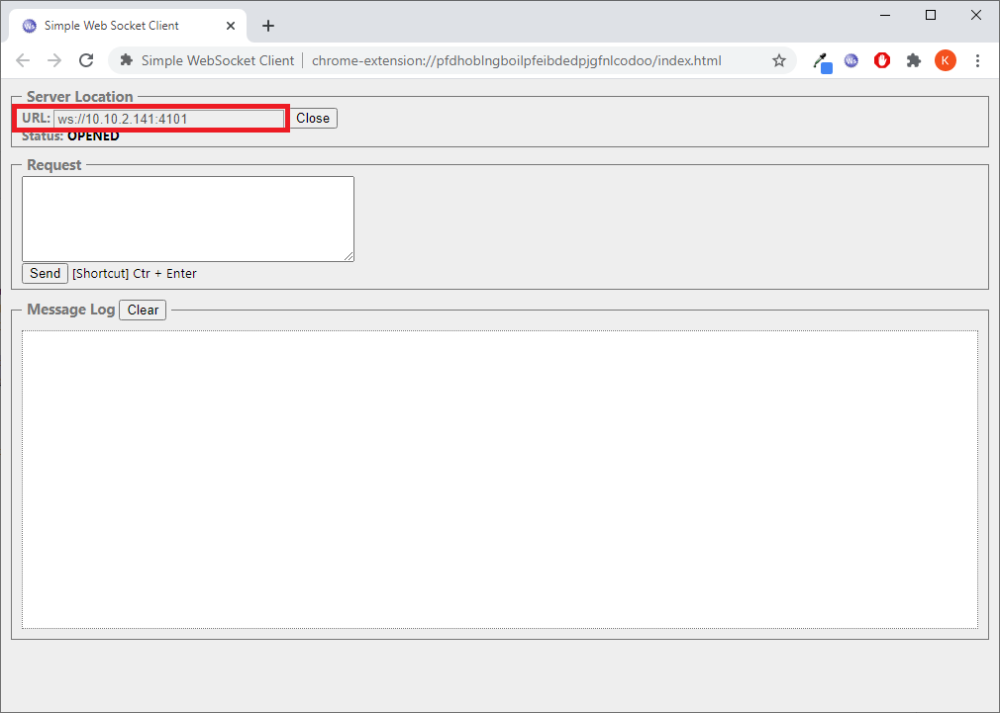
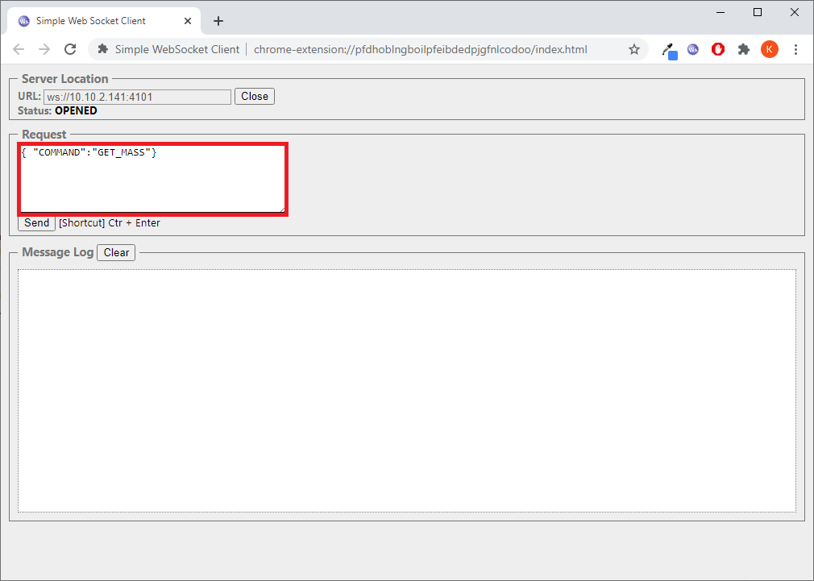
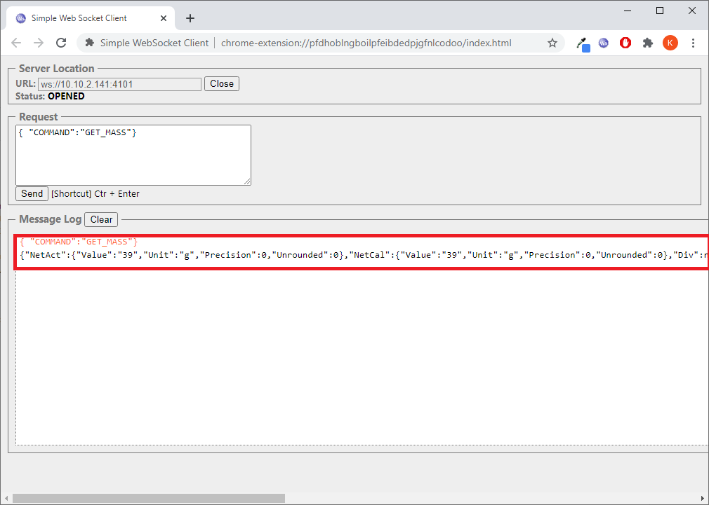
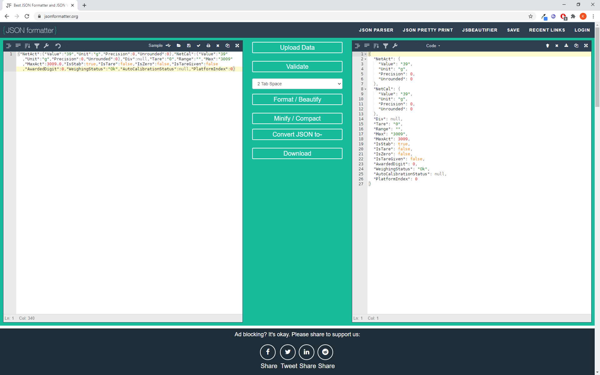

## RDA
RDA data access module

  The RDA access module enables easy communication with RADWAG terminals and weighing instruments compliant with this protocol (RST Software, HY10, PUE71).
Data exchange is carried out via WEBSOCKET connection (4101 port) using JSON objects. WEBSOCKET connection and JSON object are available for almost every programming language and their use is a global standard, which allows for their implementation in any technical solution.
  
 For example, in this study the chrome browser and the free Simple Websocket terminal will be used. After installing the chrome browser from the webstore, install Simple Websocket (link https://chrome.google.com/webstore/detail/simple-websocket-client/pfdhoblngboilpfeibdedpjgfnlcodoo)
  

  
Upon installation, in the Server Localization window, enter the terminal or weighing instrument address and port. Press Open to establish connection and set the status to OPENED.
  
  
  
In the Request field, enter a request compliant with the RDA protocol.
  
   
   
Press Send button to send the request to the terminal, which will answer immediately.
   
   
   
For easier analysis of the frame, it can be copied from the terminal to another service for easier access to data (e.g. https://jsonformatter.org/)
  
   

